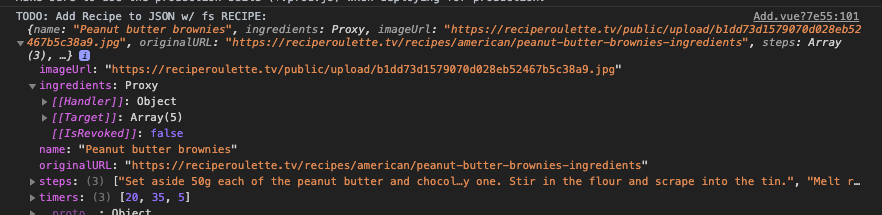

# Recipes App

## Summary
Taking a look at Vue from a React perspective. Found an interesting idea for a recipe app and I thought I'd give it a spin as it felt pretty free-form.

Idea taken from this [blog](https://www.blog.duomly.com/vue-js-project-ideas-for-beginners/):

>Idea number two is an app to keep your recipes in one place. If you have ever learned to cook, you can imagine how difficult it is to remember everything steps by step. The recipes app could be a great solution.
>
>It should consist of three main elements: the listing with all recipes, form for adding a new recipe and detailed view of the selected recipe. 
>
>Here you could practice using the Vue Router for displaying the recipes by id. 

### Step By Step
Time to get the CLI installed? No the Vue readme actually doesn't have any kind of suggestion to use their CLI (in fact they warn against doing it... so I guess we'll try it their way?). Creating index.html file w/vim brb. Little confusing off the get go still seeing as how I had to look up how to properly start a Vue project from scratch however I've got hello world so I'll get started on the next part which is fumbling through some syntax to get a appbar rendered.

Learned a bit about how Vue's reactivity between data and the DOM are linked and started learning about directives. React has a very different reactivity model so it's interesting to see a different model still written with JS.
The conditional rendering (still going through the Vue docs) is straightforward as are loops.

Component model is slick, so far it looks like it's a solid component model that would scale, I'm interested how you'd be able to work typescript into the template syntax of Vue. Looks like Vue docs expand on it a bit but I'm going to experiment with it a bit more.

At this point, having a handle of the syntax a bit I decided to launch a project using the CLI. At least at that point I'd be able to use babel and serve the project properly. After generating the project I wanted to set up some routing and it sounds like vue-router is the closest thing to React router.

After using the CLI to add the router (which was a way better experience than the Vue docs made it sound) I was ready to add the first route to the screen which is the recipe list.

Next step included adding the navbar and learned how the css works in Vue single-file components. Added the home and add routes which will drive the remainder of the recipe app.
I added the sample data and created a "RecipeList" and a "RecipeTile" component to be used by the list to display the mocked data.
At this point I'm just going to play around with understanding Vue components a bit more and I'll try to make the Recipe tile a decent abstraction for reuse among all recipes.

Both the recipe tile and the recipe page went down without a hitch and were pretty simple to set up. Dynamic routing worked easily once I realized how to use a directive with that router-link component. From there grabbing the id and finding the recipe in my JSON file was straightforward. Both components could use a bit more TLC in the CSS department but I'm going to move on to the "Add" form.

Added the initial form to at least handle the majority of the text fields and start working out my first array field.
I do have to say that so far the form experience built into Vue is WAY better than what I've used in React.
Mind you, this is with zero experience validating the form but I can't imagine that piece of it is that much harder.
The styling is simple for the components although I'm using self-rolled components for the majority of the project. 

To finish up the project I finished creating the form array for steps (swapping out a textinput for a text field) and wired up the form submission... 

Overall I learned a lot about Vue in this project and probably have a lot more in-depth to look at but I just wanted to get a feel for the framework. Overall pretty pleased with how much of my knowledge from React ports over to Vue outside of the syntax.

Having worked in React's class components definitely prepared me pretty well for the mutability of Vue's VDOM. Additionally the syntax for onclick handling and loops is nicely worked into the framework with use of directives (which I only read towards the end of the project have shorthands.)
Definitely a good example of MVVM, it was very reactive in the use-case I built and the two-way data bindings kept the overall component structure simple.

TLDR;
Things I touched on in this deep-dive:
- No-CLI vs CLI
- Vue project setup
- Routing & Route parameters
- Vue VDOM
- Vue SYntax
- Directives
- Plugins
- Event Handling
- List Rendering
- CSS
- Form Building

